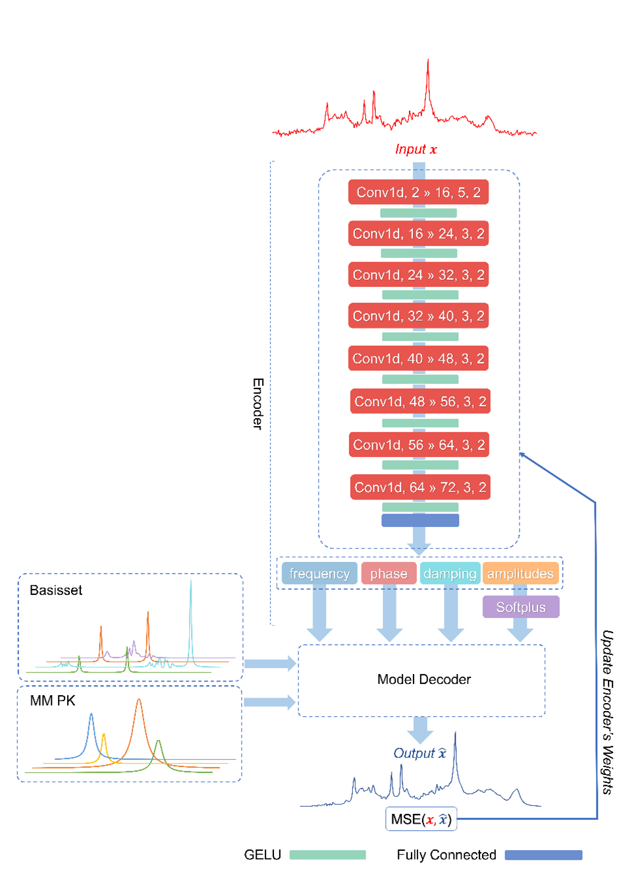

# Deep MRS Quantification
This repository provides the implementation of DeepMRS from the following paper:

Physics-informed deep learning approach to quantification of human brain metabolites from magnetic resonance spectroscopy data: [Link to the paper](https://www.sciencedirect.com/science/article/pii/S0010482523003025)

## How does it work?
- DeepMRS was implemented in Python with the help of the Pytorch lightning interface. 
- For each experiment, a "run" json file should be created. All parameters of the deep neural network and data can be stated in the json file.
There are examples of "run" json files that can be found in the "runs" folder.
- The network can be trained and tested simply by running "main.py". 
- Engine.py controls the pre and post-training steps for training and testing. dotrain() and dotest() are two functions for training and testing modes, respectively.
- Model.py is an object inherited from PyTorch lightning's "LightningModule". Now it contains four neural networks (ConvNet, MLPNet, mlp-Mixer, and ConvNext), but you can easily add your model.  Model-decoder are implemented in Model.py (forward function). 
------
## Proposed Model-informed Deep Autoencoder 
||
|:--:|
|Illustration of the proposed convolutional encoder–model decoder network. The input of the network is a complex signal \left(x\right) in the time domain, which is fed to the encoder. The encoder consisted of eight convolutional blocks and an FC layer. |
------
## Result
### Simulated
||
|:--:|
|Example spectra from the test subset of the simulated dataset quantified by (a) DQ-nMM, (b) DQ-pMM, and (c) DQ-rpMM. |
### GABA-edited in-vivo dataset([Big GABA](https://www.nitrc.org/projects/biggaba/))
||
|:--:|
| Four example spectra (a,b,c, and d) from the test subset of the Big GABA in vivo dataset quantified by DQ-rpMM. |
-----
## Acknowledgments
This project has received funding from the European Union's Horizon 2020 research and innovation program under the Marie Sklodowska-Curie grant agreement No 813120.

## Citation
If you use this codebase, or otherwise found our work valuable, please cite:
```
@article{SHAMAEI2023106837,
title = {Physics-informed deep learning approach to quantification of human brain metabolites from magnetic resonance spectroscopy data},
journal = {Computers in Biology and Medicine},
volume = {158},
pages = {106837},
year = {2023},
issn = {0010-4825},
doi = {https://doi.org/10.1016/j.compbiomed.2023.106837},
url = {https://www.sciencedirect.com/science/article/pii/S0010482523003025},
author = {Amirmohammad Shamaei and Jana Starcukova and Zenon Starcuk},
keywords = {MR spectroscopy, Inverse problem, Deep learning, Machine learning, Convolutional neural network, Metabolite quantification},
abstract = {Purpose
While the recommended analysis method for magnetic resonance spectroscopy data is linear combination model (LCM) fitting, the supervised deep learning (DL) approach for quantification of MR spectroscopy (MRS) and MR spectroscopic imaging (MRSI) data recently showed encouraging results; however, supervised learning requires ground truth fitted spectra, which is not practical. Moreover, this work investigates the feasibility and efficiency of the LCM-based self-supervised DL method for the analysis of MRS data.
Method
We present a novel DL-based method for the quantification of relative metabolite concentrations, using quantum-mechanics simulated metabolite responses and neural networks. We trained, validated, and evaluated the proposed networks with simulated and publicly accessible in-vivo human brain MRS data and compared the performance with traditional methods. A novel adaptive macromolecule fitting algorithm is included. We investigated the performance of the proposed methods in a Monte Carlo (MC) study.
Result
The validation using low-SNR simulated data demonstrated that the proposed methods could perform quantification comparably to other methods. The applicability of the proposed method for the quantification of in-vivo MRS data was demonstrated. Our proposed networks have the potential to reduce computation time significantly.
Conclusion
The proposed model-constrained deep neural networks trained in a self-supervised manner can offer fast and efficient quantification of MRS and MRSI data. Our proposed method has the potential to facilitate clinical practice by enabling faster processing of large datasets such as high-resolution MRSI datasets, which may have thousands of spectra.}
}

```
